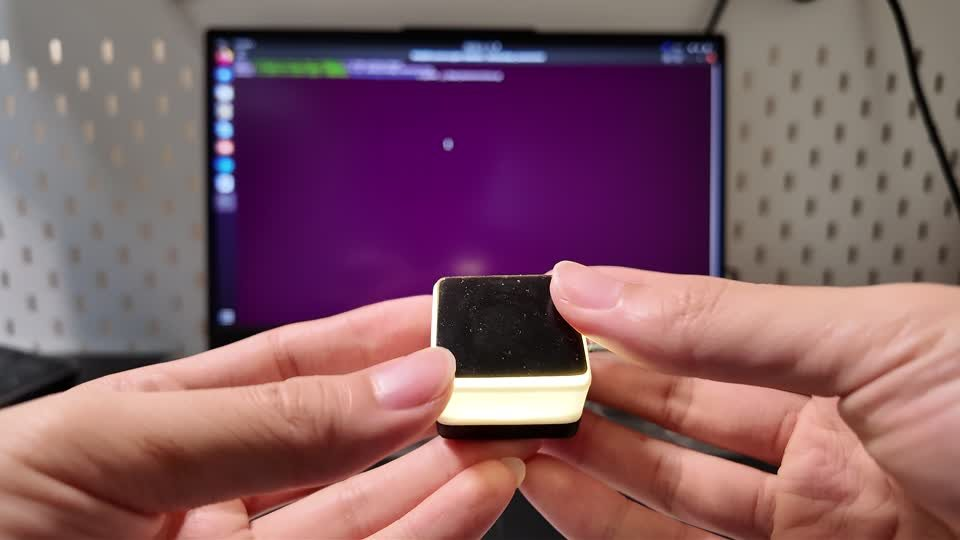
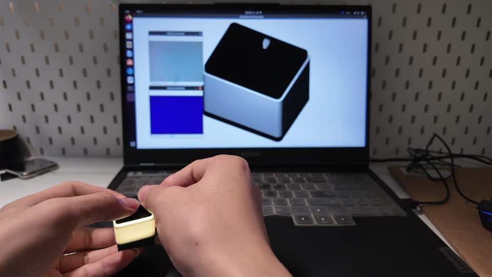
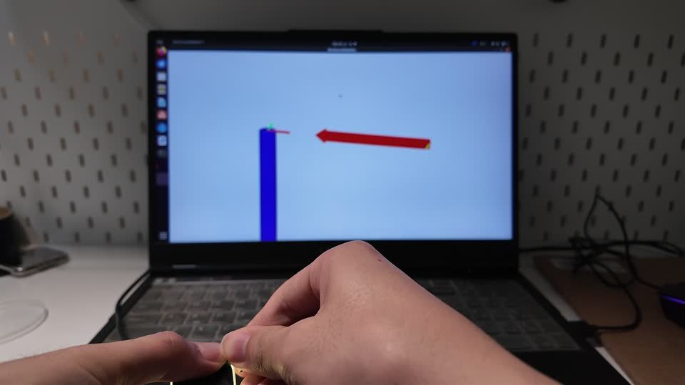

# 实物与实验演示

[返回首页](../README.md) · [验证状态](../docs/VALIDATION_STATUS.md)

三个原始视频均保留在 `Successful/`，使用 Git LFS 存储。下方提供来自原录像的连续静音节选，采用 H.264 编码供快速查看；未生成或替换实验画面。完整原视频约 541–671 MiB，若浏览器不支持 HEVC，可下载后在支持该编码的播放器中查看。

## 1. 样机外观、照明与连接

[查看 22 秒节选](Previews/hardware-preview.mp4) · [完整录像 98.75 秒](Successful/custom_tactile_sensor_hardware_showcase.mp4)

可见触觉表面、外壳、照明和 Ubuntu 接入场景；节选为原视频 0–22 秒。这是物理样机及连接展示，不能从中推算深度或力测量精度。

## 2. 按压与形貌响应

[查看 28 秒节选](Previews/shape-preview.mp4) · [完整录像 79.64 秒](Successful/shape_reconstruction_pressing_demo.mp4)

原视频 48–76 秒的连续节选显示触觉表面被接触，屏幕形貌随之变化。可支持定性交互响应；没有独立参考几何和误差评估，不能作为重建精度证明。

## 3. 六轴向量可视化

[查看 28 秒节选](Previews/vector-preview.mp4) · [完整录像 87.54 秒](Successful/realtime_6d_force_visualization_demo.mp4)

原视频 48–76 秒的连续节选显示触觉按压与轴/向量界面变化。当前未冻结对应模型、数据源、物理单位、Sensor ID 和运行配置。不能仅凭画面认定为 FT300 实测结果，也不能认定为自定义触觉模型的定量验证。

## 来源、格式与观看方式

- [原始录像映射](VIDEO_SOURCE_MAPPING.csv) 记录原文件、时长、编码与 SHA-256。录像帧率是媒体属性，不代表算法处理帧率。
- [节选映射](Previews/PREVIEW_SOURCES.json) 记录原视频哈希、精确起点、时长、压缩方式与输出哈希。
- 每个封面直接链接到仓库中的 MP4 文件页面。GitHub 文件页面如提供播放控件，可直接播放；否则使用其原始文件/下载入口。这里不依赖 Markdown 中不稳定的 `<video>` 嵌入。
- 原始视频保留原始音轨，节选移除了声音。查看视频时，完成状态以本页和验证说明为准。

较早索引位于 [DEMO_INDEX](DEMO_INDEX.md)，以本页和验证状态中的解释为准。
