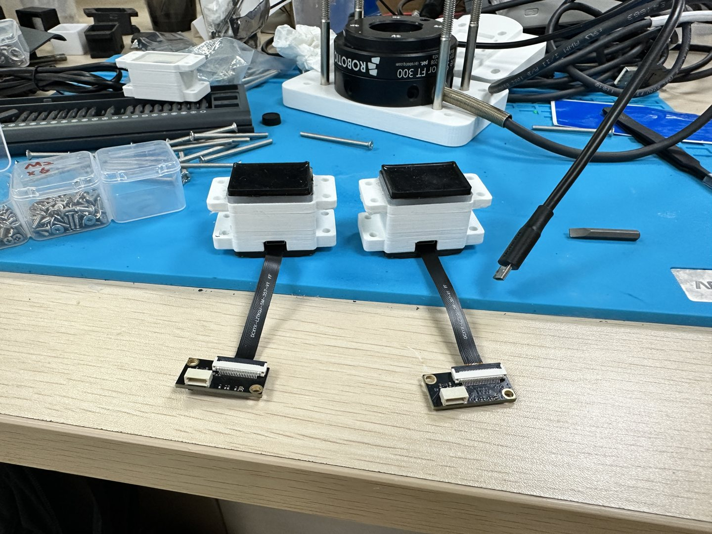
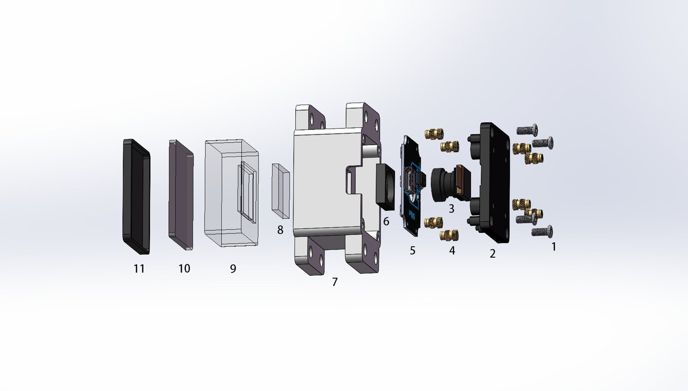
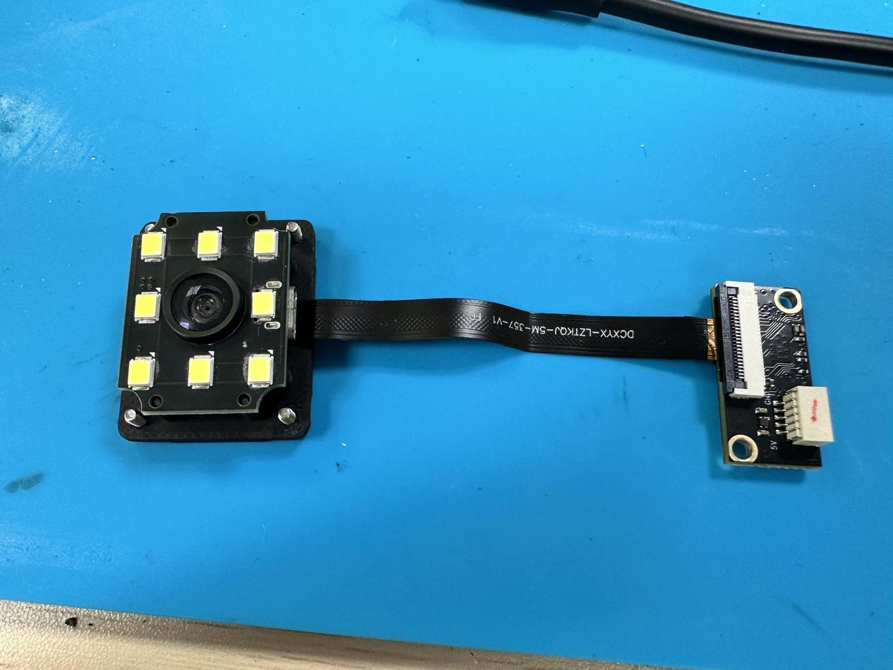
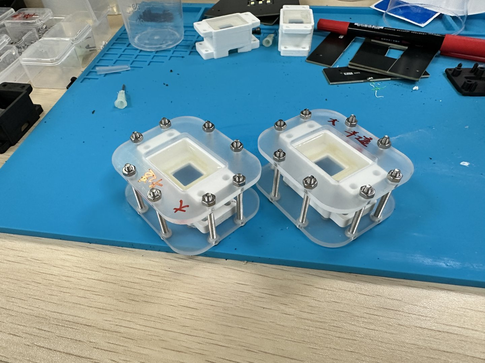
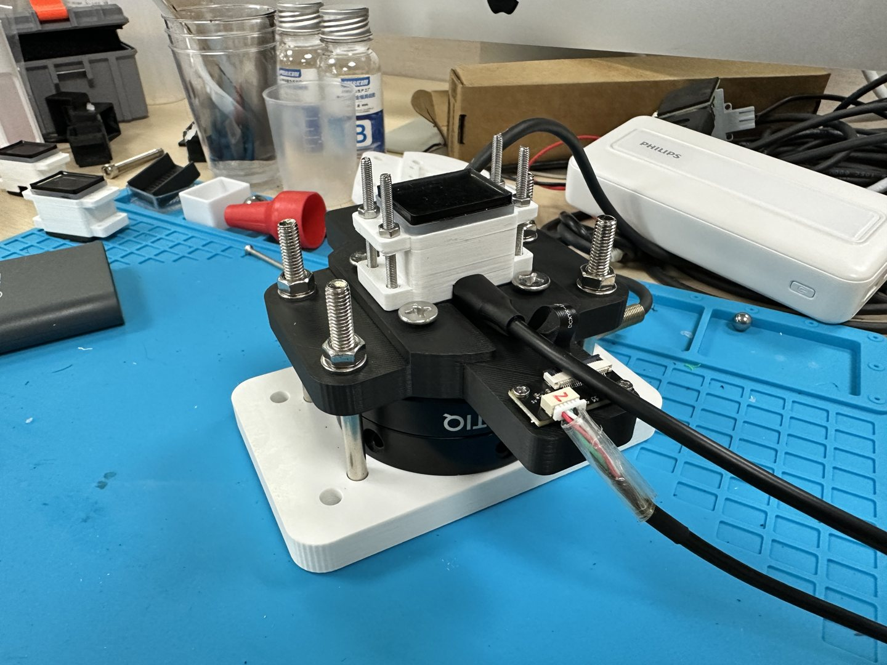
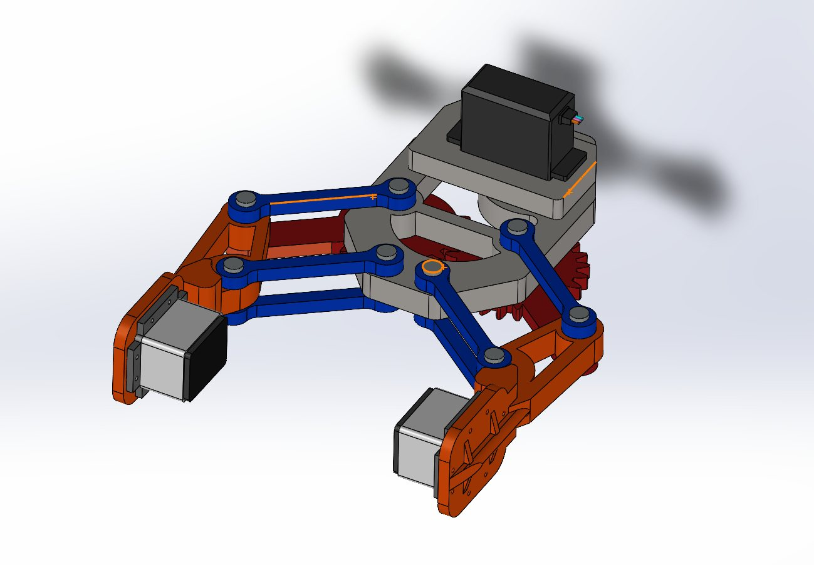

[English](README_EN.md) · 中文

# 紧凑型视触觉传感器的结构设计与硬件集成

**刘钊麟 LIU Zhaolin｜香港大学机械工程硕士毕业设计**

基于开源 **9DTact** 感知原理，围绕相机更换后的安装空间、光学对准、内部布线和制造装配，完成两套传感器样机，并搭建与 **Robotiq FT300** 机械耦合的实验平台。本仓库展示我的机械结构、硬件集成、硅胶制备、样机调试与实验工作，也保留软件来源和验证边界。

*两套成品样机；外置解码板通过柔性排线连接传感器头部。[原始照片与图集](03_Hardware/08_Renders_and_Photos/PHOTO_CATALOG.md)*

## 快速查看

| 想了解什么 | 从这里进入 |
|---|---|
| 结构设计、CAD、PCB 与制造 | [硬件作品与工程文件](03_Hardware/README.md) |
| 真实样机和交互响应 | [三个演示视频及观看说明](05_Demos/README.md) |
| 我负责什么、怎样解决问题 | [项目概览与个人贡献证据](docs/PROJECT_OVERVIEW.md) |
| 软件安装和复现 | [本仓库冻结快照的运行入口](02_Software/SOFTWARE_INDEX.md) |

## 我的职责与工程贡献

- **结构紧凑化与相机安装适配**：以 OV5640 相机和独立解码板为成像链路，调整外壳、相机定位与固定、窗口支撑及引线空间；通过打印与装配检查落实结构方案。
- **照明和内部布线集成**：围绕镜头布置八 LED 照明板，协调镜头、窗口和 PCB 的相对位置；将解码板外置，为柔性排线保留避让，减少紧固件夹线及承载路径干涉。
- **制造与样机装配**：组织打印件、亚克力模具与紧固件，完成封边、硅胶配制、真空脱泡、分层浇注、固化脱模和最终装配，形成两套实物。
- **调试与实验平台**：处理广角畸变和暗角导致的标定点识别问题，开发手动 7 × 9 点选择界面；进行图像校正、形貌重建实验，以及 FT300 转接结构和实验平台集成。
- **软件集成与数据流程**：在上游算法基础上整理传感器配置、FT300 同步采集、数据检查、训练/推理及 ROS Noetic 工作流。代码实现、已有实物演示和定量验证分别标注。

**来源说明：** 9DTact 原理、上游算法与 `Original/` 属于原作者成果。保留的 LED PCB 工程、Gerber 压缩包、电子 BOM 和贴片坐标与上游快照相同；这里突出我的安装适配和照明集成，不能据此认定独立原创电路设计。[逐项贡献与来源](docs/PROJECT_OVERVIEW.md)

## 关键结构改进

| 设计问题 | 采取的方法 | 可查看的证据 |
|---|---|---|
| 新相机、解码板和柔性排线占用安装空间 | 相机头内置、解码板外置，协调定位基座与外壳 | [自定义零件](03_Hardware/01_CAD_Source/SolidWorks_Parts/Optimized_Sensor/)；下方电子集成照片 |
| 镜头、照明与触觉窗口需保持相对位置 | 定位与固定结构、中心镜头周围的八 LED 板、窗口支撑 | [爆炸图原件](03_Hardware/08_Renders_and_Photos/Assembly_and_Design/sensor_exploded_view_annotated.jpg) |
| 排线易与紧固件或受力结构干涉 | 预留出口和内部间隙，外置解码板及线缆避开主承载路径 | [制造与装配记录](03_Hardware/09_Manufacturing_Notes/ASSEMBLY_AND_MANUFACTURING_NOTES.md) |
| 触觉传感器需与六维力参考设备机械耦合 | 设计 FT300 和传感器连接基座，构建可施加载荷的平台 | [转接 CAD](03_Hardware/01_CAD_Source/SolidWorks_Parts/Test_Connections/)；下方实物图 |

当前以“紧凑化结构优化”描述成果，不采用“体积缩减约 30%”：尚缺同一口径下的基线与改型完整包络尺寸及计算记录。答辩材料中的约 42 × 38 × 34 mm 为设计描述，未视为本次 CAD 测量或整机体积验证。

## 样机制造与实验平台

分层硅胶结构保留 G50 透明支撑层、G5 半透明变形层和 G25 黑色接触层的制作记录。制造工作重点是模具封边、气泡控制、分层浇注和脱模装配；这些记录体现制造过程，不构成材料性能或寿命测试。

还保留了双指夹爪的传感器安装方案、左右夹爪 CAD/STL 和装配渲染。当前材料能支持**装配机构设计**，尚不能证明已完成实物抓取或触觉闭环控制；“方舟无限 R5”型号对应关系待补证据。

## 实验与演示

观看 [样机展示、按压形貌响应和六轴向量可视化](05_Demos/README.md)。视频展示实物交互和界面变化，**六轴向量的运行模型、数据源、单位与传感器编号没有完整会话记录**，不能将其认定为 FT300 实测值或自定义触觉模型的精度证明。

相机手动点选与图像校正、球形压头实验及螺纹接触重建均有材料可查。当前冻结软件中，Sensor 1/2 核心相机映射数组相同，两个传感器的活动深度 LUT 均来自上游；历史实验描述与当前活动文件需分别理解。

## 完成状态与验证边界

| 范围 | 目前能确认的状态 |
|---|---|
| 结构、制造、两套样机与 FT300 耦合 | 有 CAD、制造照片、实物照片和定性演示 |
| 图像校正及形貌重建 | 有脚本、数组、标定过程图片和定性结果；缺独立误差评估 |
| FT300 置零、坐标变换和同步采集 | 代码及离线测试存在；缺冻结的真实采集会话日志 |
| 自定义触觉图像到六维力映射 | 训练与推理代码存在；缺规范同步训练集、正式 checkpoint 和独立精度结果 |
| 夹爪安装 | 有 CAD/STL 与渲染；未由当前材料证实实物抓取验证 |

2026-09-11 在 Windows / Python 3.12 下重新运行：**30 项离线测试通过，冻结软件静态检查通过**。未运行 Ubuntu/ROS 实机、相机、FT300、模型训练或 SolidWorks 重建。[详细验证说明](docs/VALIDATION_STATUS.md)

## 资料目录

| 目录 | 主要内容 |
|---|---|
| [01_Academic](01_Academic/ACADEMIC_INDEX.md) | 展示版论文 PDF、答辩、阶段记录及 33 项文献索引 |
| [02_Software](02_Software/SOFTWARE_INDEX.md) | 可在本仓库访问的完整冻结软件快照 |
| [03_Hardware](03_Hardware/README.md) | CAD、STL、DXF、PCB、BOM、照片与制造记录 |
| [04_Data_and_Models](04_Data_and_Models/DATA_MODEL_INDEX.md) | 标定文件索引、过程图片、形貌结果及数据协议 |
| [05_Demos](05_Demos/README.md) | 视频封面、观看入口、演示条件与解释 |

其他入口：[项目时间线](PROGRESS_TIMELINE.md) · [版本来源](VERSION_FREEZE.md) · [文件校验清单](SUBMISSION_MANIFEST.csv) · [技术交接存档](docs/archive/HANDOVER.md)

## 软件运行、致谢与许可

复现请从 [软件安装与运行导航](02_Software/SOFTWARE_INDEX.md) 进入，遵循快照内的 Ubuntu 20.04 / Python 3.8 / ROS Noetic 环境说明。运行时一次选择一个传感器，勿混用数据、配置和模型。

感谢 [9DTact 原作者与项目](https://github.com/linchangyi1/9DTact)。软件来源固定为关联仓库 commit `98ebb7da0010df27ef634f9868e557d77fa73ec5`，本仓库已保存该快照。新增的作品集文档属于外层整理版本，未改动冻结软件。原交接快照与远端有已核实的换行及内部清单差异，详见 [版本说明](VERSION_FREEZE.md)。

[许可与素材来源](docs/RIGHTS_AND_ATTRIBUTION.md) 按软件、CAD/PCB、照片、论文和第三方文献分别说明。本作品集没有为全部资产新增统一开源许可；上游已有许可和作者信息继续有效。
